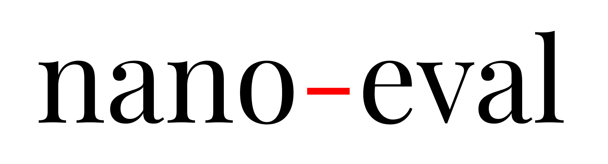

<div align="center">
  
  <br />
  <br />

<p align="center">
    Nano-eval is a fast and super light-weight evaluation toolkit for LLM
</p>

</div>

## Overview

NanoEval 是一个轻量高性能的 LLM 评测工具，采用三阶段流水线架构：**输入准备 → 推理 → 评分**，全部通过 Ray 分布式调度。

详细使用指南见 [`docs/evaluation.md`](docs/evaluation.md)。

## Quick Start

```bash
# Online 后端
python run.py \
  --output-dir outputs/my_eval \
  --task-dir outputs/nano_eval \
  --tasks "gpqa_diamond@4,math500@1,aime2025@8,ifeval@1" \
  --backend online \
  --api-key YOUR_KEY \
  --base-url http://YOUR_ENDPOINT/v1 \
  --model YOUR_MODEL \
  --temperature 1.0 \
  --max-tokens 131072 \
  --concurrency 1024 \
  --num-actors 4

# Offline 后端（本地 SGLang）
python run.py --output-dir outputs/my_eval --backend offline \
  --model-path /path/to/model --tp-size 8 --num-actors 4 ...

# 单独运行各阶段
python run.py --output-dir ./out --stage preprocess --backend offline ...
python run.py --output-dir ./out --stage inference --backend offline ...
python run.py --output-dir ./out --stage score --backend offline ...
```

## Supported Tasks

> 运行前需下载任务数据：https://huggingface.co/datasets/MikaStars39/nano-eval

| 类型 | 任务名 |
|------|--------|
| 数学竞赛 | `aime2024`, `aime2025`, `amc2023`, `math500`, `minerva`, `hmmt2025` |
| 科学问答 | `gpqa_diamond` |
| 多选题 | `mmlu`, `mmlu_pro`, `ceval` |
| 指令跟随 | `ifeval`, `ifbench` |

**Pass@k**：`--tasks "aime2025@8,math500@1"` — `@k` 省略时用 `--pass-k` 默认值。

## Project Structure

```
run.py                     # 主入口（Ray 编排）
nanoeval/
  backend/                 # 推理后端（offline SGLang / online API）
  reward/                  # 评分器（math / ifeval / gpqa / mmlu）
  ray/                     # Ray 分布式 actor 封装
  utils/                   # CLI 参数、任务加载、日志
recipes/                   # 实验脚本
  eval/examples/           # 标准评测示例
  context_rot/             # Context Rot 长对话退化评测
docs/                      # 文档
```

## Examples

`recipes/eval/examples/` 包含完整运行示例（`thinking_online.sh`、`thinking_offline.sh`）。

## Acknowledgements

Some code is cited and modified from [OpenICL](https://github.com/Shark-NLP/OpenICL). Some datasets and prompts are modified from [chain-of-thought-hub](https://github.com/FranxYao/chain-of-thought-hub) and [instruct-eval](https://github.com/declare-lab/instruct-eval).
